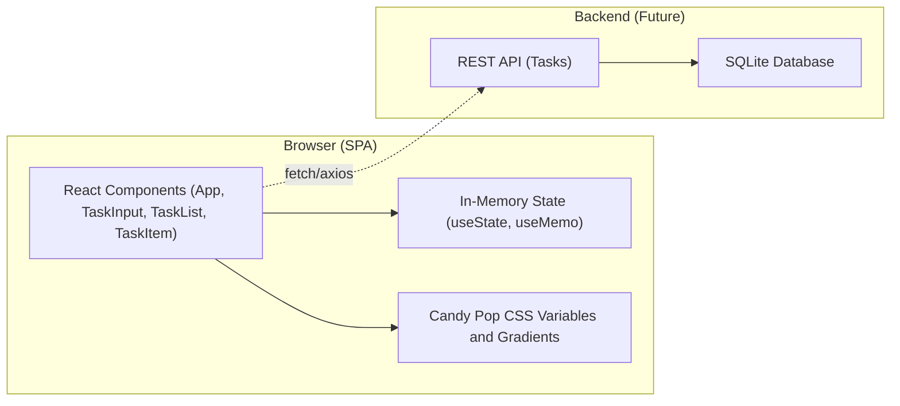
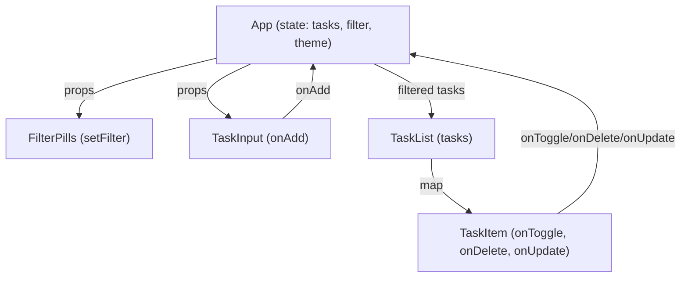
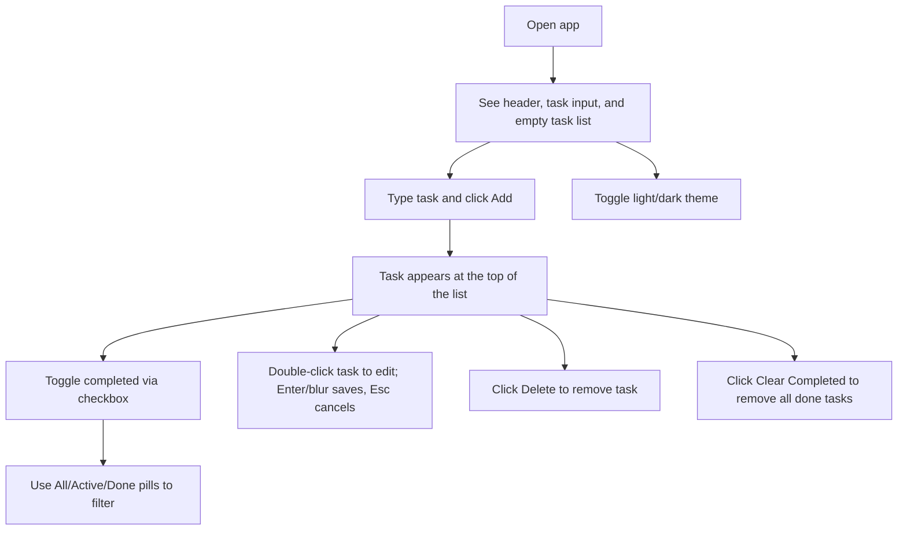

# Candy Pop To-Do App – Architecture and System Design

## Introduction

### Purpose
This document describes the system design of the Candy Pop To-Do application. It outlines the frontend architecture, component responsibilities, state flow, styling system, and the future-facing connection path to a SQLite-backed persistence layer while staying aligned with the current client-only React implementation.

### Scope
- Frontend component architecture and data flow.
- Styling and theming approach.
- User flow through the single-page interface.
- Future extension for SQLite persistence via a thin backend.

## High-Level Architecture

### Current State (Client-Only)
The application is a single-page React app rendered in the browser. All data is kept in memory within the App component using React state. There is no network layer or persistence in the current implementation.

### Future State (With SQLite)
A minimal backend can be introduced to persist tasks in a SQLite database. The frontend would interact with a REST API to perform CRUD operations. This extension is optional and not present in the current project.

## Component Architecture

### Components
- App: Root component; owns theme state, tasks array, filter state, and provides handlers for CRUD and filtering. Renders header, task input, list, and footer counters.
- CandyBackground: Decorative gradient background layer.
- FilterPills: Header control for All/Active/Done filtering.
- TaskInput: Input form to add a new task with friendly hints.
- TaskList: Renders empty state or a list of TaskItem components.
- TaskItem: Displays a single task with toggle, inline edit, and delete actions.
- AppMeta: Footer metadata.

### Responsibilities and Data Flow
- App holds the source of truth for tasks and passes down handlers:
  - handleAdd(text)
  - handleToggle(id)
  - handleDelete(id)
  - handleUpdate(id, newText)
  - handleClearCompleted()
- FilterPills updates the filter state in App.
- TaskInput calls onAdd when form is submitted.
- TaskList maps tasks to TaskItem.
- TaskItem calls onToggle/onDelete/onUpdate via props.

## State Model

### Task Shape
- id: string (generated via uid utility)
- text: string
- completed: boolean
- createdAt: number (timestamp)

### Derived State
- filteredTasks computed via useMemo using the active filter.
- activeCount computed by counting tasks where completed is false.

## Theming and Styling

### Approach
- Candy Pop theme implemented using CSS variables defined in App.css.
- data-theme attribute on the root element toggles between light and dark, updating variables to adjust colors and shadows.
- Gradients and soft shadows reinforce the playful aesthetic.

### Key Tokens (from styleThemeData)
- primary: #F472B6
- secondary: #A78BFA
- success: #10B981
- error: #EF4444
- background: #FEF7FF
- surface: #FFFFFF
- text: #374151
- gradients: primary and secondary linear-gradients for buttons and accents.

## User Flow

## Future Architecture: SQLite Integration

### Overview
- Introduce a lightweight backend with endpoints:
  - GET /tasks
  - POST /tasks
  - PATCH /tasks/:id
  - DELETE /tasks/:id
  - DELETE /tasks?completed=true (clear completed)
- Backend uses SQLite for persistence with a single tasks table:
  - id TEXT PRIMARY KEY
  - text TEXT NOT NULL
  - completed INTEGER NOT NULL DEFAULT 0
  - created_at INTEGER NOT NULL

### Frontend Changes
- Replace local state operations with calls to the REST API.
- Keep Candy Pop UI unchanged; add loading and error states as needed.
- Optionally add optimistic updates for responsiveness.

## Technology Stack

### Current
- React 18, react-scripts (Create React App)
- CSS with custom properties for theming
- Jest + React Testing Library setup in place

### Future (Optional)
- Node.js/Express or similar for REST API
- SQLite for persistence
- Fetch or axios for HTTP calls

## Quality and Testing

### Current Tests
- App renders with the expected header title (“Candy Pop Todos”).

### Future Tests
- Add unit tests for handlers (add, toggle, update, delete).
- Integration tests for filter logic and clear completed.
- Visual regression tests for theme toggling.

## Deployment

### Current
- Build with react-scripts and host as a static site.

### Future
- Deploy backend alongside the static frontend; point the frontend to API base URL via environment configuration.

## References

- Source files:
  - react_frontend/src/App.js
  - react_frontend/src/App.css
  - react_frontend/README.md
